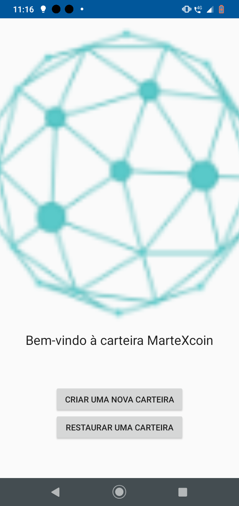
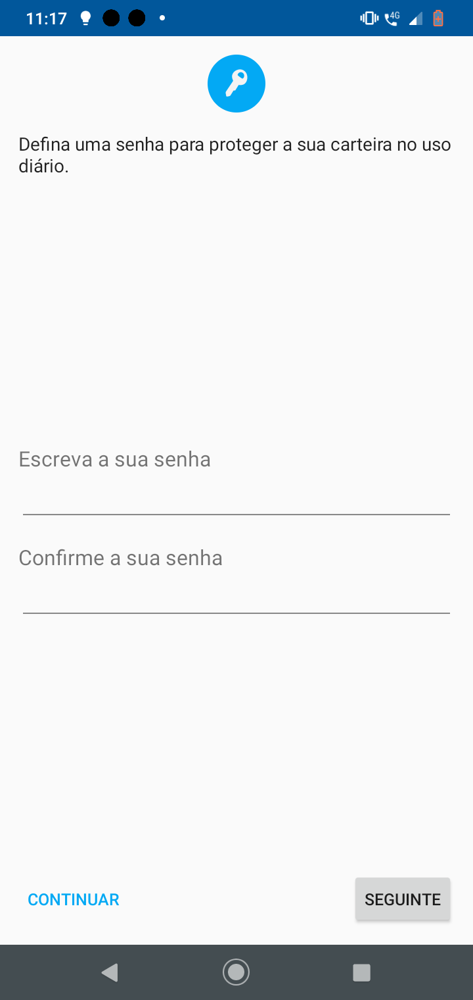
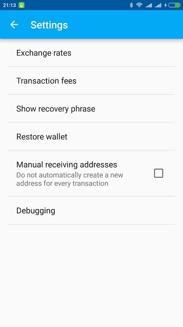
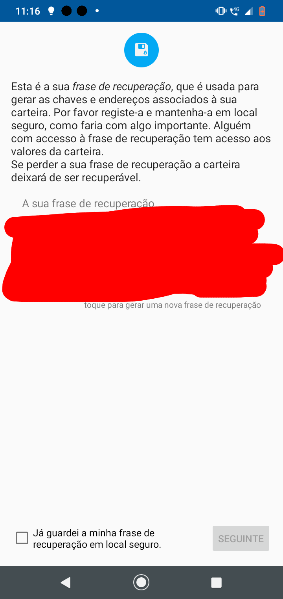

.. meta::
   :description: Getting started with sending and receiving MarteX on your Android device
   :keywords: martex, mobile, wallet, android, send, receive, addresses, getting started

.. _martex-android-getting-started:

Getting started
===============

Creating a new wallet
---------------------

When you first start your MarteX Wallet, it will automatically generate a
new wallet for you. It will then ask you to enter a PIN to protect
spending from the wallet. The first thing you should do after setting a
PIN is back up the wallet by tapping the menu button in the top left
corner and selecting **Safety** > **View recovery phrase**. You will
need this phrase to recover the funds later if you lose or damage your
phone or need to transfer the account to another device. Write the
phrase down and store it in a safe place - if you lose this, you will
also lose access to your funds forever. If you prefer, you can also back
up a password protected wallet file by selecting **Safety** > **Back up
wallet**.

*Viewing the recovery phrase for a new wallet in MarteX Wallet for
Android*

Restoring from backup
---------------------

If you already have an existing MarteX Wallet for Android, you can restore
it at this point by tapping the menu button in the top left corner and
selecting **Configurations** > **Restore from recovery phrase**. Carefully enter
your recovery phrase and tap **Restore**. Your wallet may restart, and
it will take some time for any past transactions and balances to appear.

.. image:: img/android-restore1.png
    :width: 160 px
.. image:: img/android-restore2.png
    :width: 160 px
.. image:: img/android-restore3.png
    :width: 160 px
.. image:: img/android-restore4.png
    :width: 160 px

*Restoring an existing wallet from recovery phrase in MarteX Wallet for
Android*

Receiving
---------

Tap the **Recive** word at the left of the screen to
receive MarteX. The wallet will generate and display a QR code for the
other device to scan, and you can optionally enter the martex 
value of the transaction to save the payer time. You can tap the menu
button in the top right corner and select **Copy address** to copy and
paste it in another app to send it to a person paying you remotely. You
will receive a notification when the transfer occurs, and you can view
the confirmation status on the main screen and the balance in the top
right corner. MarteX Wallet for Android considers a transaction spendable
after 1 block confirmations has taken place (approx. 1 minute), Martexcoin android wallet always uses FastSend transactions.

.. image:: img/android-receive2.png
    :width: 160 px
.. image:: img/android-receive3.png
    :width: 160 px
.. image:: img/android-receive4.png
    :width: 160 px

*Receiving MarteX and viewing your transactions and balance in MarteX Wallet
for Android*

Sending
-------

Tap the **Send coins** button at the bottom right of the screen to send
MarteX. You will be prompted to type, paste or scan (by tapping the round
QR button) a MarteX address, the amount to pay and whether to use
InstantSend. Note that this information may already be included if you
are scanning a QR code. The automatically determined network fee is
displayed. Tap **Send** to complete the transaction.

.. image:: img/android-send1.png
    :width: 160 px
.. image:: img/android-send2.png
    :width: 160 px
.. image:: img/android-send3.png
    :width: 160 px
.. image:: img/android-send4.png
    :width: 160 px

*Sending MarteX and viewing your transactions and balance in Dash Wallet
for Android*
