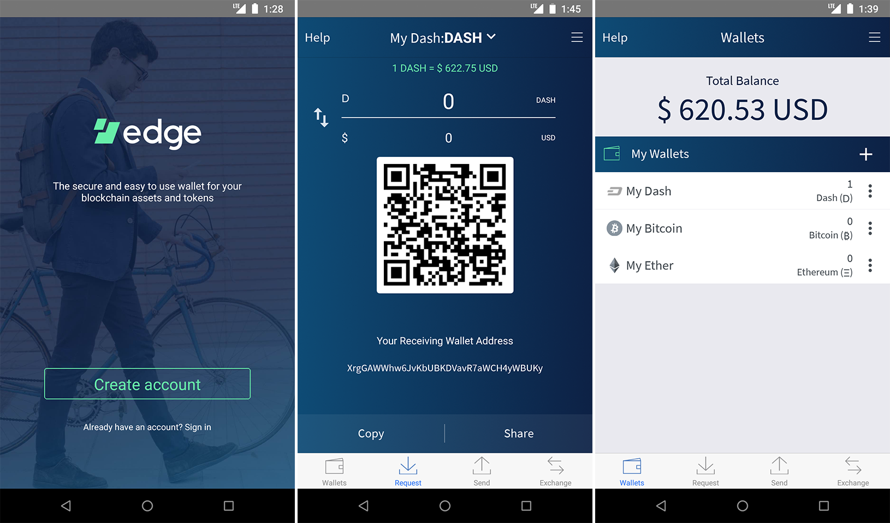

.. meta::
   :description: Description of different wallets available to use and spend MarteX cryptocurrency
   :keywords: martex, wallet, core, electrum, android, ios, paper, hardware, trezor, ledger, web, recovery, text, sms

.. _wallets:

=======
Wallets
=======

Whenever you are storing objects with a market value, security is
necessary. This applies to barter systems as well as economies using
currency as a medium of exchange. While banks store balances on a
private ledger, cryptocurrencies store balances under unique addresses
on a distributed public ledger. The cryptographic private keys to access
the balance stored on each public address are therefore the object of
value in this system. This section of the documentation discusses
different practical methods of keeping these keys safe in wallets, while
still remaining useful for day-to-day needs.

For safety, it is not recommended to store significant funds on
exchanges or software wallets. If you are holding cryptocurrency worth
more than the device you use to store it, you should purchase a
:ref:`hardware wallet <hardware-wallets>`.

.. _martex-core-wallet:

MarteX Core Wallet
==================

MarteX Core Wallet is the full official release of MarteX, and supports all
MarteX features as they are released, including InstantSend and
PrivateSend, as well as an RPC console and governance features. MarteX
Core Wallet (sometimes known as the QT wallet, due to the QT software
framework used in development) is a professional or heavy wallet which
downloads the full blockchain (several GB in size) and can operate as
both a full node or masternode on the network. Because of the
requirement to hold a full copy of the blockchain, some time is required
for synchronisation when starting the wallet. Once this is done, the
correct balances will be displayed and the functions in the wallet can
be used. MarteX Core Wallet is available for macOS, Linux, Raspberry Pi
and Windows.

Features:

-  AnonSend
-  FastSend
-  Wallet encryption
-  Coin control and fee control
-  QR code generation and address book
-  Masternode commands and voting
-  Automated backup
-  Debug console
- All MarteX Core functions

Available documentation:

   `MarteXcore installation <MarteXcore/installation.rst>`_

   `MarteXcore interface <MarteXcore/interface.rst>`_

   MarteXcore/send-receive.rst` <>`_

   MarteXcore/anonsend-fastsend.rst` <>`_

   MarteXcore/backup.rst` <>`_

   MarteXcore/cmd-rpc.rst` <>`_

   MarteXcore/advanced.rst` <>`_

.. figure:: dashcore/img/windows/106329009.png
   :width: 400 px

   MarteX Core Wallet

MarteX Android Wallet
=====================

MarteX offers a standalone wallet for Android, with development supported 
by the MarteX budget. The MarteX Android Wallet supports advanced MarteX 
features, including contact management and InstantSend. You can scan and 
display QR codes for quick transfers, backup and restore your wallet, 
keep an address book of frequently used addresses, pay with NFC, sweep 
paper wallets and more.

.. toctree::
   :includehidden:
   :maxdepth: 1

   android/installation.rst
   android/getting-started.rst
   android/advanced-functions.rst

.. image:: android/img/android1.png
    :width: 160 px
.. image:: android/img/android2.png
    :width: 160 px

*MarteX Android Wallet*

.. _dash-ios-wallet:

MarteX iOS Wallet
=================

MarteX offers a standalone wallet for iOS, with development supported by
the MarteX budget. The official MarteX Wallet supports advanced MarteX
features such as InstantSend sending and receiving. You can also scan
and display QR codes for quick transfers and backup your wallet using a
secure recovery phrase.

.. toctree::
   :includehidden:
   :maxdepth: 1

   ios/installation.rst
   ios/getting-started.rst
   ios/advanced-functions.rst

.. image:: ios/img/ios1.png
    :width: 160 px
.. image:: ios/img/ios2.png
    :width: 160 px

*MarteX iOS Wallet*

.. _paper-wallets:

MarteX Paper Wallet
===================

The `MarteX Paper Wallet generator <https://martexcoin.org/paperwallet/>`_ allows you
to generate, encrypt and secure the keys to a single MarteX address on a
clean computer without ever connecting to the internet. Perfect for long
term secure storage.

.. toctree::
   :maxdepth: 1

   paper.rst

.. figure:: img/paper-addresses.png
   :width: 400 px

   MarteX Paper Wallet

.. _hardware-wallets:

Hardware Wallets
================

A hardware wallet is a type of device which stores private keys for a
blockchain in a secure hardware device, instead of in a database file
such as wallet.dat used with common software wallets. This offers major
security advantages over software wallets, as well as practical benefits
over paper wallets. To date, there is no verifiable evidence of hardware
wallets being compromised by viruses, and they are also immune to
keylogger attacks that could be used to steal passwords to unlock the
private keys used with software wallets.

Hardware wallets function by storing your private keys in a protected
area of a microcontroller. It is impossible for the private key to leave
the device in plain text - only the signed output of the cryptographic
hash is ever transmitted to the device interacting with the blockchain,
such as your computer or smartphone. Most hardware wallets feature a
screen which allows you to independently confirm the address you are
sending to is correct.

At the moment
This section lists the most common commercial hardware wallets supporting
MarteX, although some other enthusiast projects may also be available.

Third Party Wallets
===================

These wallets have been developed by external developers to support
MarteX. Many third party wallets support multiple different
cryptocurrencies at the same time, or integrate instant cryptocurrency
exchanges.

   `Zcore adroid wallet <zcore/README.md>`_

   Edge Wallet

.. _web-wallets:

Web Wallets
===========

Web wallets are services which keep a MarteX balance for you, while
maintaining control of the private keys on your behalf. Any MarteX stored
on `exchanges <exchanges>`_ falls under this category, but there are
also some services able to store MarteX for you through simple
Google/Facebook login systems. Be extremely careful with web storage, as
your MarteX is only as secure as the reputation of the company storing it
for you.

Wallet Guides
=============

Documentation in this section describes common tasks and questions
relating to all wallets.

   recovery.rst

   signing.rst