.. meta::
   :description: Recovering MarteX wallets from files, private keys or recovery phrases
   :keywords: martex, wallet, recovery, password, lost, mobile, core, phrase, private key

.. _wallet-recovery:

===============
Wallet Recovery
===============

Long-time users of cryptocurrency sometimes find old wallet files on USB
drives or cloud storage that they have forgotten about. Others may have
a backup, but can't remember the software they used to create it, or
have forgotten the password. Other users may have an old version of MarteX
Core that no longer works because the network has upgraded. This
documentation is intended to help these users restore access to their
funds.

Determining the backup format
=============================

The first step is to determine the format of your backup. In most cases,
this will either be a file, probably named *wallet.dat*, or a phrase of
words. In some cases, you may have stored the private key for a MarteX
address directly. The following list shows the possibilities and methods
to restore your wallet in order of probability.

- Backup is stored in an older version of MarteX Core that no longer works

  - Follow instructions for restoring wallet files using :ref:`MarteX Core <dashcore-restore>`

- Backup is a file

  - If file name is similar to wallet.dat, try to restore using :ref:`MarteX Core <dashcore-restore>`
  - If file name is similar to martex-wallet-backup or includes the word 'mobile', try to restore using :ref:`MarteX Wallet for Android <martex-android-file-restore>`

- Backup is a phrase of words

  - If 12 words long, try to restore using :ref:`MarteX Electrum wallet <martex-electrum-phrase-restore>` or MarteX wallet for :ref:`Android <martex-android-phrase-restore>` or :ref:`iOS <martex-ios-phrase-restore>`, depending what you used to create the backup
  - If 13 words long, try to restore using :ref:`MarteX Electrum wallet <martex-electrum-phrase-restore>`
  - If 12, 18 or 24 or 25 words long, try to restore with the :ref:`hardware wallet <hardware-phrase-restore>` you used to create the recovery phrase

- Backup is a long string of random characters or a QR code

  - If 34 characters long and starting with X, this is a public address and cannot be used to restore access to lost funds. You need the private key.

- If 51 characters long and starting with 7, this is a :ref:`private key in WIF <privkey-restore>`, import using MarteX Core
- If 58 characters long and starting with 6P, this is a :ref:`BIP38 encrypted private key <privkey-restore>`, decrypt using paper wallet then import using MarteX Core

Once you have determined your backup format, follow the links to view
the restore guide for that format.

File Backups
============

.. _dashcore-restore:

MarteX Core
---------

One of the most common wallet backup formats is a *wallet.dat* file from
MarteX Core wallet. Before you begin, make absolutely sure that you have a
copy of this file stored somewhere safe in case the restore process
accidentally corrupts your wallet file! In most cases, *wallet.dat*
backups will also be protected by a password, which you will need to
know to regain access to your MarteX funds. If you already have MarteX Core
installed, first ensure it has been updated to the latest version by
clicking **Help > About MarteX Core**. Compare this with the latest
available version of `MarteX Core on the website
<https://www.martex.org/downloads/>`_ as follows:

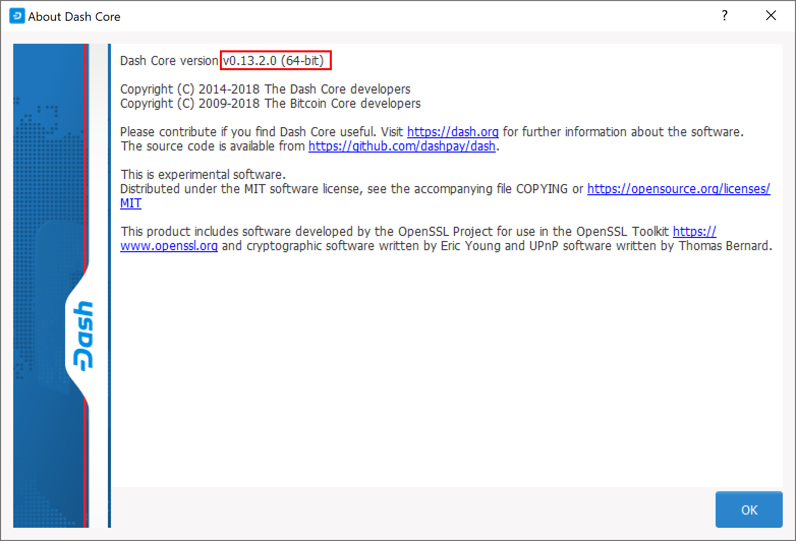
.. figure:: img/recovery-website-version.png
   :width: 400px

   Comparing the installed version of MarteX Core with the latest version
   available on the website

Update MarteX Core to the latest version according to the
:ref:`installation instructions <dashcore-installation>`. If you have
only a wallet file and no existing installation of MarteX Core, simply
install MarteX Core according to the :ref:`installation instructions
<dashcore-installation>` and start it once to create the DashCore
folder. Then close MarteX Core and copy the *wallet.dat* file you want to
restore to the DashCore folder in the location specified below,
replacing or renaming the existing file.

+----------+--------------------------------+-----------------------------------------------------------------------------------------------+
| Platform | Path to data folder            | How to navigate                                                                               |
+==========+================================+===============================================================================================+
| Linux    | ~/                             | Go to your home folder and press **Ctrl+H** to show hidden files, then open ``.dashcore``     |
+----------+--------------------------------+-----------------------------------------------------------------------------------------------+
| macOS    | ~/Library/Application Support/ | Press **Shift + Command + G**, type ``~/Library/Application Support``, then open ``DashCore`` |
+----------+--------------------------------+-----------------------------------------------------------------------------------------------+
| Windows  | %APPDATA%                      | Press **Windows Key + R** and type ``%APPDATA%``, then open ``DashCore``                      |
+----------+--------------------------------+-----------------------------------------------------------------------------------------------+

If your existing version of MarteX Core is older than v0.12.1.x, you may
need to rename your data folder from ``MarteX`` to ``DashCore``.

To repair a broken installation, navigate to the DashCore folder and
delete all *.log* and *.dat* files except *wallet.dat*. The following
files can be safely deleted:

- *banlist.dat*
- *budget.dat*
- *db.log*
- *debug.log*
- *fee_estimates.dat*
- *governance.dat*
- *mncache.dat*
- *mnpayments.dat*
- *netfulfilled.dat*
- *peers.dat*

Leave ``.conf`` files and the folders (such as ``backups``, ``blocks``,
``chainstate``, etc.) intact, since they will help you get started
faster by providing a copy of the blockchain and your settings.

Now open MarteX Core and wait for blockchain synchronization to complete.
Your wallet will be restored/upgraded and all balances should be
displayed. You should ensure you have the correct password by trying to
unlock your wallet from **Settings > Unlock Wallet** to make sure you
can actually create transactions using your balances. If you have any
problems with your balance not appearing, try to force a rescan of the
blockchain by going to **Tools > Wallet Repair** and selecting **Rescan
blockchain files**. **Rebuild index** may also help. MarteX Core will
restart and perform a full scan of the blockchain.

.. image:: img/recovery-rescan.png
   :width: 400px
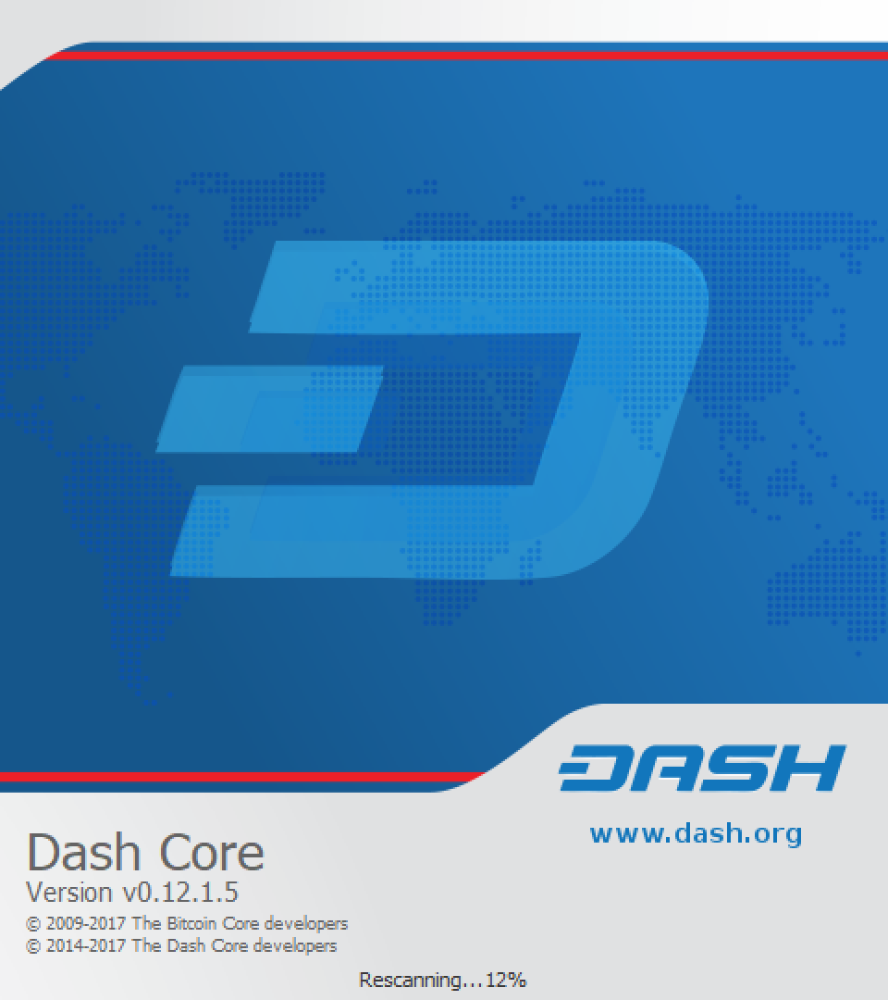

   Forcing MarteX Core to rescan the blockchain

At this stage, recovery is complete and you should make another backup
using **File > Backup Wallet** or following the instructions :ref:`here
<dashcore-backup>`. If you have any further problems, try asking on the
`forum <https://www.martex.org/forum/topic/daemon-and-qt-wallet-support.64/>`_, 
`Reddit <https://www.reddit.com/r/dashpay/>`_ or the
#martex-support-desk channel at `MarteX Nation Discord
<http://dashchat.org/>`_.

.. _dash-android-file-restore:

MarteX Android
------------

Similar to MarteX Core wallet, MarteX Wallet for Android can back up your
wallet to a file. To restore this wallet on another device, simply copy
the backup file to the ``/Downloads`` folder of your device using either
a computer connected by USB or a file manager app on the device. Ensure
your MarteX wallet is fully updated in the Play Store, then open MarteX. If
you have an existing balance, either make another backup or transfer it
to an external address, because restoring a wallet will replace your
existing wallet!

Click the menu button in the top left corner, select **Safety >
Restore** wallet and select the appropriate file from the list. Enter
your password and click **Restore**. This may take some time, and your
balance will be displayed when complete.

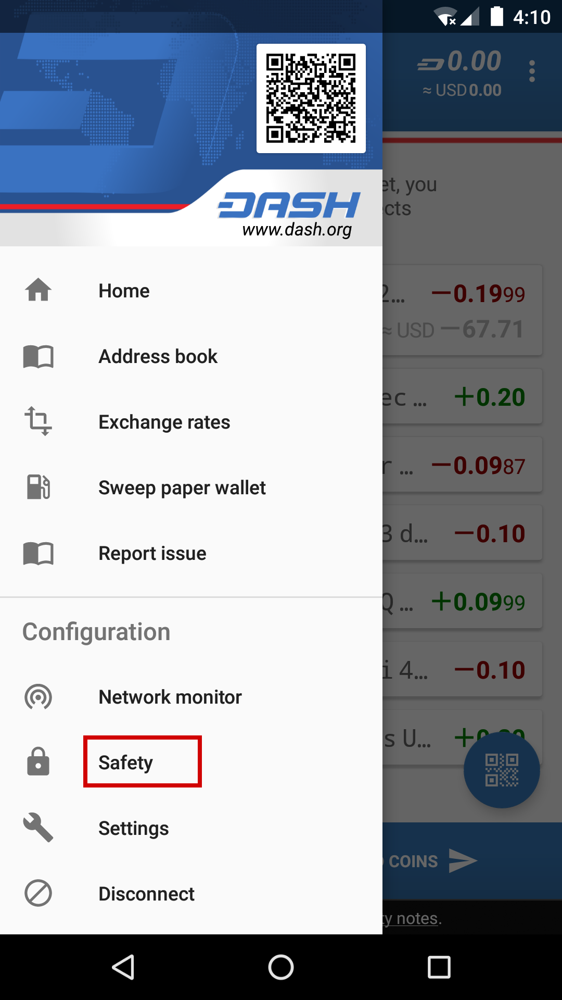
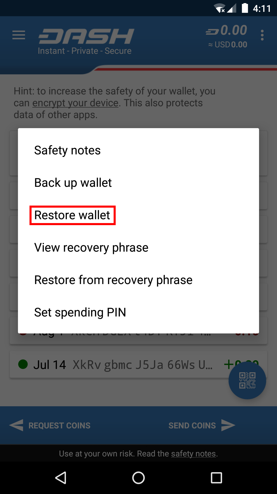
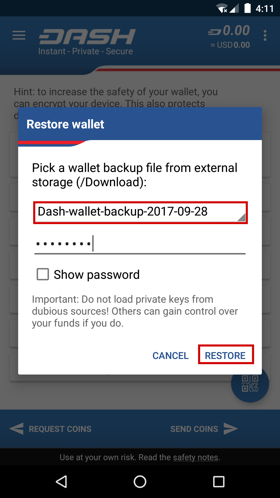

*Restoring a file backup using MarteX Wallet for Android*

Recovery Phrases
================

If you have a 12-word phrase and feel certain your backup was made on an
iOS or Android mobile device, follow these instructions.

.. _dash-android-phrase-restore:

12-word phrase on Android
-------------------------

Ensure your MarteX wallet is fully updated in the Play Store, then open
MarteX. If you have an existing balance, either make another backup or
transfer it to an external address, because restoring a wallet will
replace your existing wallet! Click the menu button in the top left
corner, select **Safety > Restore from recovery phrase** and enter your
12-word phrase.

.. image:: img/recovery-android4.png
   :width: 200px
.. image:: img/recovery-android5.png
   :width: 200px

*Restoring a 12-word recovery phrase using MarteX wallet for Android*

.. _dash-ios-phrase-restore:

12-word phrase on iOS
---------------------

Ensure your MarteX wallet is fully updated in the App Store, then open
MarteX. If this is the first time you are opening the app, you can enter
your recovery phrase directly by selecting **Recover wallet** on the
start screen. If you have an existing balance, either make another
backup or transfer it to an external address, because restoring a wallet
will replace your existing wallet!

Click the menu button in the top left corner, select **Settings >
Start/recover another wallet**. Enter your current wallet recovery
phrase, then the app will reset and you will see the option to **Recover
wallet** again.

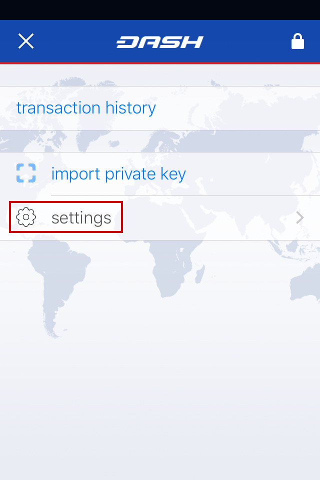
.. image:: img/recovery-ios2.png
   :width: 200px
.. image:: img/recovery-ios3.png
   :width: 200px
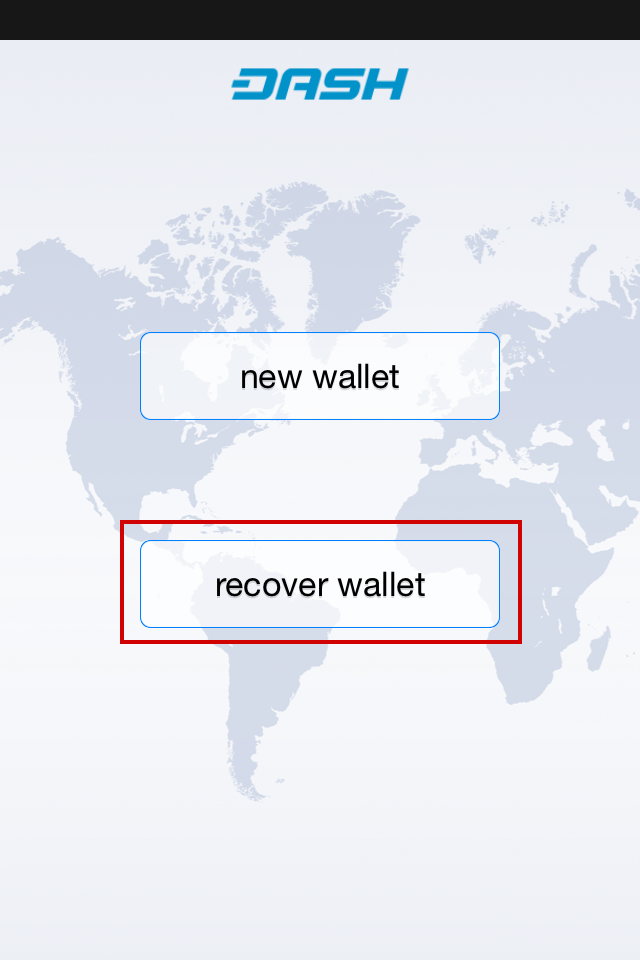
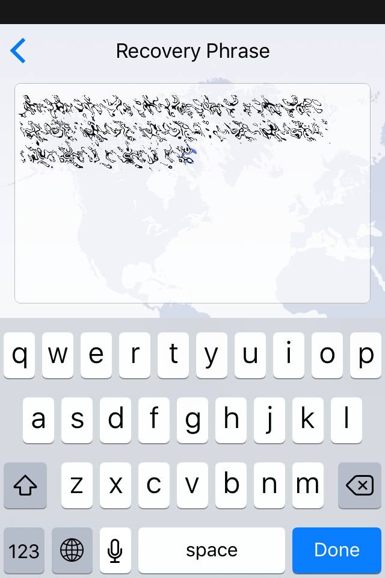

*Restoring a 12-word recovery phrase using MarteX wallet for iOS*

.. _dash-electrum-phrase-restore:

12/13-word phrase on MarteX Electrum
----------------------------------

Ensure you are using the latest version of MarteX Electrum according to
the installation instructions :ref:`here <electrum-installation>`. MarteX
Electrum supports multiple simultaneous wallets, so you can safely
restore to a new wallet file without losing your old wallet. Click
**File > New/Restore** and enter a file name to store your new wallet.
Then select **I already have a seed** and enter your 12/13-word recovery
phrase. Enter a new password for your wallet and click **Next** to
recover your addresses from the recovery phrase.

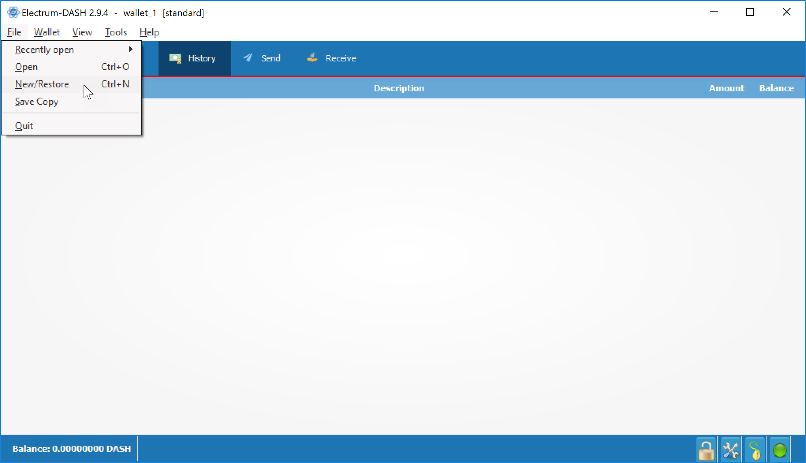
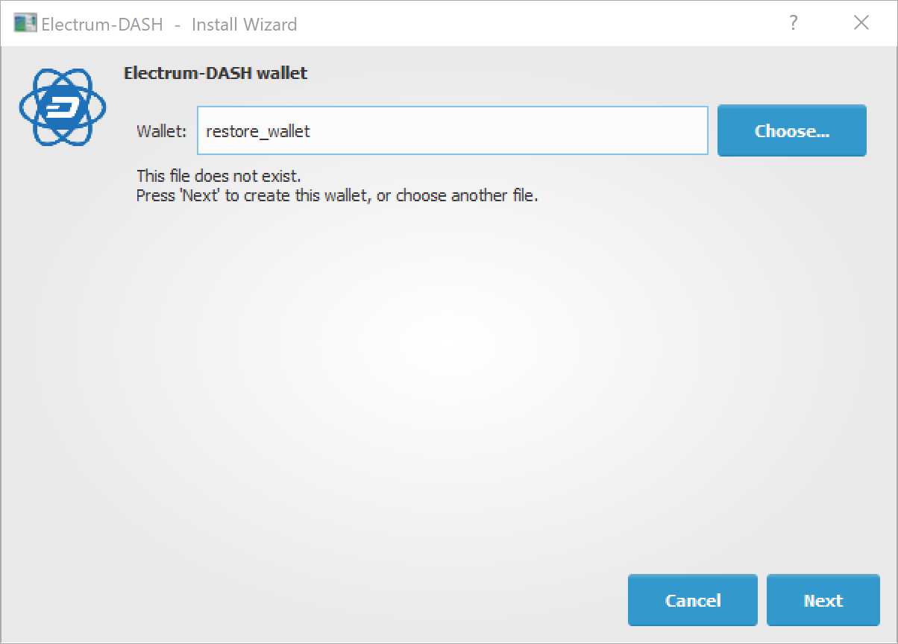
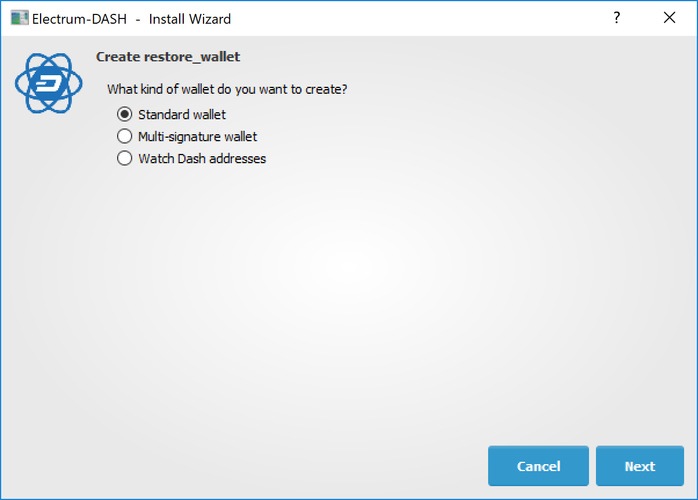
.. image:: img/recovery-electrum4.png
   :width: 300px
.. image:: img/recovery-electrum5.png
   :width: 300px
.. image:: img/recovery-electrum6.png
   :width: 300px

*Restoring a 12-word recovery phrase using MarteX Electrum*

.. _hardware-phrase-restore:

Hardware wallet recovery phrases
--------------------------------

If your 12, 18 or 24-word recovery phrase was generated by a hardware
wallet, follow these instructions:

- `KeepKey <https://shapeshift.zendesk.com/hc/en-us/articles/360014555779-How-Do-I-Recover-On-My-KeepKey->`_
- `Ledger Nano S <https://support.ledger.com/hc/en-us/articles/360005434914-Restore-from-recovery-phrase>`_
- `Trezor <https://doc.satoshilabs.com/trezor-user/recovery.html>`_

.. _dash-ios-restore-electrum:

Restoring an iOS wallet in MarteX Electrum
----------------------------------------

You can use your MarteX iOS recovery phrase with MarteX Electrum to recover
funds if you lose access to your iOS device for any reason. However,
since the wallet derivation paths are not identical, the process only
works in one direction, meaning it is not possible to restore a MarteX
Electrum wallet using the MarteX iOS wallet. Also, because the import
process uses an xprv key rather than the recovery phrase directly, it
will not be possible to display the recovery phrase in MarteX Electrum. It
is therefore recommended to move the funds (either to a standard MarteX
Electrum wallet or some other wallet) once recovery is successful to
ensure that standard backup procedures work as expected.

Recovery takes place in two steps. First, we will convert the MarteX iOS
recovery phrase into an xprv key. In the second step, we will import the
xprv key into MarteX Electrum.

Retrieving the correct MarteX iOS xprv key
^^^^^^^^^^^^^^^^^^^^^^^^^^^^^^^^^^^^^^^^

Go to the `BIP39 Mnemonic Code Converter
<https://iancoleman.io/bip39/>`_ page. This is a useful tool for
manipulating/displaying BIP32/39 seed data. If you are not comfortable
performing this procedure online, an offline version is available by
downloading the file described in `these instrutions
<https://github.com/iancoleman/bip39#standalone-offline-version>`_. Once
the tool is loaded in your browser, complete the following steps:

1. Enter your 12 word seed phrase in the **BIP39 Mnemonic** field.
2. Leave **BIP39 Passphrase** blank.
3. Set coin to **MarteX**.
4. Under **Derivation Path**, click the **BIP44** tab.
5. Copy the value shown in **Account Extended Private Key**.

Importing the xprv key into MarteX Electrum
^^^^^^^^^^^^^^^^^^^^^^^^^^^^^^^^^^^^^^^^^

1. Open MarteX Electrum and click **File** -> **New/Restore**.
2. Type a name for your wallet.
3. Select **Standard wallet**.
4. Select **Use public or private keys**.
5. Paste in your value from **Account Extended Private Key**.
6. Optionally enter a password.

MarteX Electrum should now detect your MarteX iOS balance and you should
have complete access to your funds. The seed phrase won't be available
in MarteX Electrum , so you will just need to follow the steps above again
if you want to restore this wallet from the recovery phrase again. It is
recommended to send your funds to a new MarteX Electrum wallet instead and
follow :ref:`standard backup procedures <electrum-backup>`.

Older versions of the MarteX iOS wallet used **BIP32** addresses under the
``m/0'`` derivation path. The wallet should migrate these funds over to
BIP44 addresses during normal use, but some residual balance may be
under this derivation path, so restoring the **BIP32 Extended Private
Key** may be helpful in some situations. Please see `this forum thread
<https://www.martex.org/forum/threads/restore-breadwallet-martex-funds-to-your-electrum-martex-wallet-tested.8335/>`_ 
for further discussion on this process.

.. _privkey-restore:

Private Keys
============

Most wallets offer a function to import an address from a private key,
see the documentation for your wallet for specific instructions. While
private keys can be stored in many ways, in this example we will work
through the process of restoring a private key from a paper wallet using
MarteX Core. If you only have a QR code and not the key, use a barcode
scanning app (`Android <https://play.google.com/store/apps/details?id=com.google.zxing.client.android>`_
or `iOS <https://apps.apple.com/us/app/quick-scan-qr-code-reader/id483336864>`_) 
to read the code first.

First, start MarteX Core and unlock your wallet by selecting **Settings >
Unlock Wallet**. Enter your password, then open the debug console by
selecting **Tools > Debug Console**. In the console, type the following,
replacing the example private key with your key::

  importprivkey 7rPQWnMrh3oWLtZrzt1zLRSCVyuBbwnt7fRBXPp2EwcPhtzXSzp

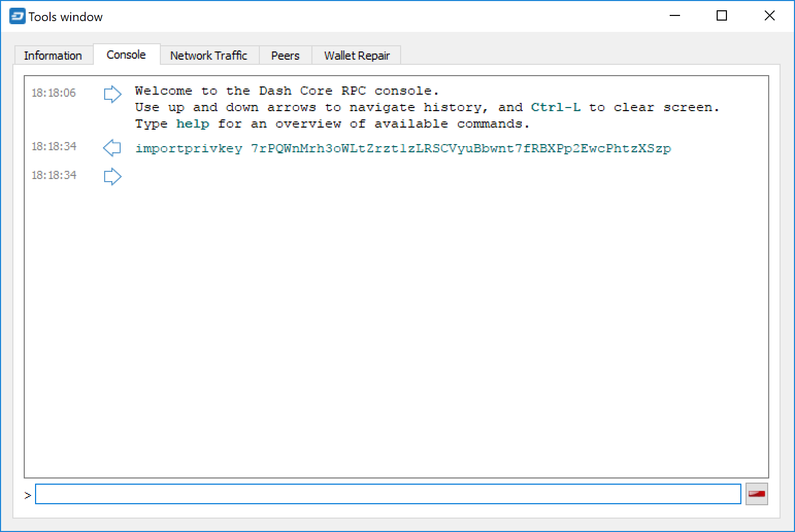

   Importing a private key using the debug console in MarteX Core wallet

MarteX Core will rescan the blockchain for transactions involving the
public address of this key and enter the transactions and balance in
your wallet.

The private key must be in wallet import format (WIF). If your key is
encrypted using BIP38 (key begins with 6P instead of 7), you must first
decrypt it to view the key in WIF. To do so, go to
https://paper.martex.org/ and click **Wallet Details**. Enter the
encrypted private key in the field and click **View Details**. You will
be prompted for the password, and your keys will be decrypted. Find the
key named **Private Key WIF** and import this into your wallet.

.. image:: img/recovery-paper-decrypt.png
   :width: 300px
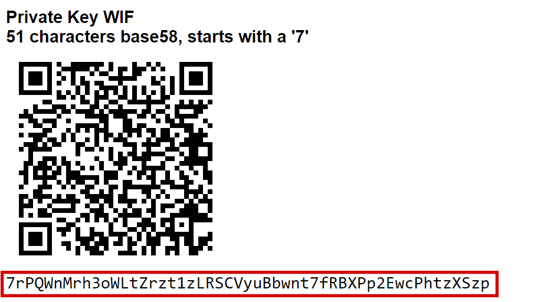

*Decrypting a BIP38 encrypted key to WIF for import in MarteX Core wallet*

Forgotten Passwords
===================

In most cases, if you selected a strong password and have forgotten or
lost it, there is practically no hope of recovery. The encryption used
by the MarteX wallets is extremely strong by design, and a well-chosen
password should defeat most brute force cracking attempts. If you can
recall some details of the password, particularly its length or
sequences of characters that may be included, then brute force password
cracking techniques may be worth attempting. Several services exist to
do this, or you can attempt it yourself. Because MarteX Core is based on
Bitcoin Core, most approaches to apply brute force to crack a Bitcoin
wallet will also work for MarteX wallets.

- `Wallet Recovery Services <https://www.walletrecoveryservices.com/>`_
- `BTCRecover <https://github.com/gurnec/btcrecover>`_
